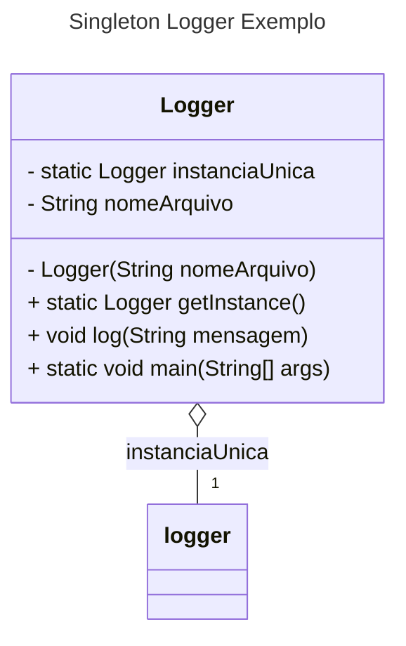
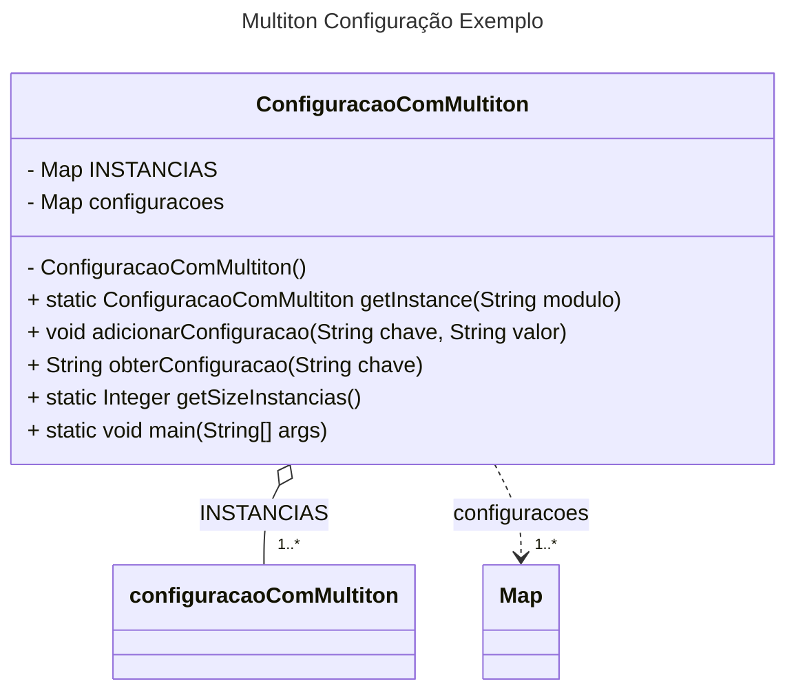
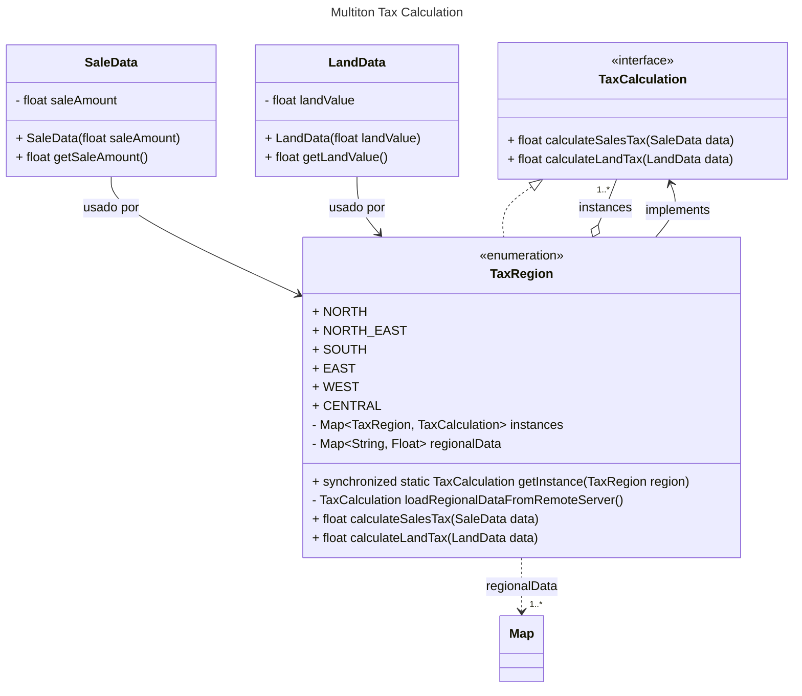
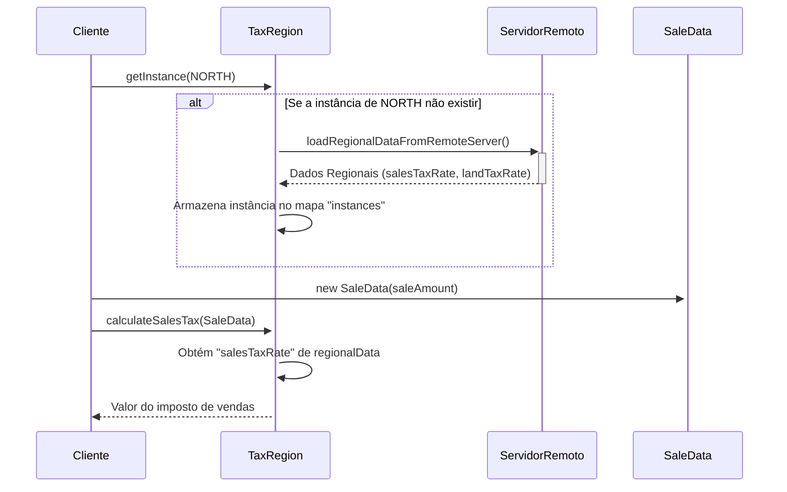

# Singleton e Multiton - Padrões de Projeto

## Intenção

A intenção do **Singleton** é garantir que uma classe tenha uma única instância e fornecer um ponto global de acesso a ela. O **Multiton**, por outro lado, é utilizado para garantir que uma classe tenha uma única instância para cada chave específica, criando um conjunto de instâncias, mas ainda assim controlando seu número.

## Também Conhecido Como

- **Singleton**: Padrão de design de instância única.
- **Multiton**: Padrão de design de instâncias múltiplas controladas.

## Motivação

### Problema Resolvido pelo Singleton

Em alguns cenários, é necessário ter uma única instância de uma classe em todo o sistema. Um exemplo disso é o gerenciamento de conexões com banco de dados ou configuração de log, onde ter várias instâncias pode gerar problemas, como a perda de dados ou uso excessivo de recursos. O **Singleton** resolve isso ao garantir que só exista uma instância e forneça acesso a ela de qualquer parte do sistema.

### Exemplo de Aplicação do Singleton:

- **Problema**: O sistema de logs precisa de uma instância única de uma classe `Logger` para registrar todas as mensagens de log. Ter várias instâncias de `Logger` pode gerar conflitos de acesso e performance.
- **Solução com Singleton**: O padrão Singleton garante que apenas uma instância do `Logger` exista, e ela pode ser acessada de qualquer parte do código.

### Problema Resolvido pelo Multiton

Quando se precisa de várias instâncias de uma classe, mas cada uma com um contexto único (por exemplo, um banco de dados diferente ou configuração de log por módulo), o **Multiton** é necessário. Diferente do Singleton, o Multiton cria instâncias separadas para diferentes chaves, garantindo que não se criem instâncias desnecessárias ou repetidas.

### Exemplo de Aplicação do Multiton:

- **Problema**: Um sistema de configuração com várias instâncias para diferentes módulos (ex.: módulo de pagamento, módulo de relatórios) precisa de um objeto único para cada módulo, mas cada um deve ser independente.
- **Solução com Multiton**: O Multiton cria uma instância única para cada módulo, controlando a criação de instâncias de forma eficiente.

## Aplicabilidade

- **Use Singleton** quando você precisa garantir que uma classe tenha apenas uma instância em todo o sistema, como para configurações globais ou para recursos compartilhados como conexões de banco de dados.
- **Use Multiton** quando você precisar de uma instância única para cada chave ou contexto, mas ainda assim com um número controlado de instâncias.

## Estrutura

### Diagrama UML do Singleton:



### Diagrama UML do Multiton:



## Participantes

### No diagrama do Singleton:

- **Logger**: Classe responsável por controlar a criação e gerenciar a instância única. Contém um método `static getInstance()`, que será utilizado para o retorno da instância única. 

### No diagrama do Multiton:

- **ConfiguracaoComMultiton**: Gerencia múltiplas instâncias da classe com base em uma chave. Ele garante que cada chave única corresponde a uma única instância, permitindo compartilhar configurações específicas por módulo.

- **Instâncias**: Mantidas no mapa INSTANCIAS, que associa cada chave (String) a sua respectiva instância de ConfiguracaoComMultiton. Este mapa é o núcleo do padrão Multiton, garantindo controle centralizado das instâncias.

- **Configurações**: Dados armazenados dentro de cada instância em configuracoes. Este mapa contém pares chave-valor para configurações específicas ao contexto do módulo correspondente.

## Outro Exemplo

### Sem Singleton:

```java
public class SemSingleton {
    public class Logger {
    private String nomeArquivo;

    public Logger(String nomeArquivo) {
        this.nomeArquivo = nomeArquivo;
    }

    public void log(String mensagem) {
        System.out.println("Escrevendo no arquivo " + nomeArquivo + ": " + mensagem);
        // Simulando escrita no arquivo (sem implementar realmente)
    }
}

public class Aplicacao {
    public static void main(String[] args) {
        // Criando múltiplas instâncias do Logger
        Logger logger1 = new Logger("log1.txt");
        Logger logger2 = new Logger("log2.txt");

        // PROBLEMA 1: Logs inconsistentes
        // Cada instância escreve em um arquivo diferente. Se o sistema
        // depende de um único arquivo centralizado, isso causa confusão.
        logger1.log("Primeira mensagem de logger1");
        logger2.log("Primeira mensagem de logger2");

        // PROBLEMA 2: Conflito de arquivos
        // Se várias instâncias tentarem gravar no mesmo arquivo, dados podem ser corrompidos.
        Logger logger3 = new Logger("log1.txt");
        logger3.log("Mensagem de logger3");

        // PROBLEMA 3: Perda de centralização
        // Não há um único ponto de acesso ao Logger. Alterar configurações em uma
        // instância (ex.: mudar o arquivo de log) não afeta as outras instâncias.

        // PROBLEMA 4: Sobrecarga de recursos
        // Criar muitas instâncias pode consumir memória desnecessariamente
        // e aumentar a complexidade do sistema.
    }
}

}
```

### Com Singleton:

```java
// Implementação de um Logger usando Singleton para resolver problemas anteriores
public class Logger {
    private static Logger instanciaUnica; // Garantindo uma única instância
    private String nomeArquivo;

    // Construtor privado para evitar criação de múltiplas instâncias
    private Logger(String nomeArquivo) {
        this.nomeArquivo = nomeArquivo;
    }

    static {
        instanciaUnica = new Logger("logCentral.txt");
    }

    // Método público para obter a única instância do Logger
    public static Logger getInstance() {
        return instanciaUnica;
    }

    public void log(String mensagem) {
        System.out.println("Escrevendo no arquivo " + nomeArquivo + ": " + mensagem);
        // Simulando escrita no arquivo (sem implementação real para simplicidade)
    }

    public static void main(String[] args) {
        // Obtendo a única instância do Logger
        System.out.println(Logger.getInstance());

        // PROBLEMA 1 RESOLVIDO: Logs consistentes
        // Todos os logs são centralizados em um único arquivo
        Logger.getInstance().log("Primeira mensagem de log");
        Logger.getInstance().log("Segunda mensagem de log");

        // PROBLEMA 2 RESOLVIDO: Conflito de arquivos
        // Como não há outro arquivo, o log é escrito no arquivo original
        Logger.getInstance().log("Terceira mensagem de log");

        // PROBLEMA 3 RESOLVIDO: Centralização
        // O acesso ao Logger é feito por meio do método `getInstance`, garantindo
        // que alterações na configuração (como nome do arquivo) sejam feitas na
        // instância única.

        // PROBLEMA 4 RESOLVIDO: Economia de recursos
        // Apenas uma instância do Logger é criada, reduzindo consumo de memória.
    }
}

```

### Sem Multiton:

```java
import java.util.HashMap;
import java.util.Map;

public class ConfiguracaoSemMultiton {
    private String modulo;
    private Map<String, String> configuracoes;

    public ConfiguracaoSemMultiton(String modulo) {
        this.modulo = modulo;
        this.configuracoes = new HashMap<>();
    }

    public void adicionarConfiguracao(String chave, String valor) {
        configuracoes.put(chave, valor);
    }

    public String obterConfiguracao(String chave) {
        return configuracoes.get(chave);
    }

    public String getModulo() {
        return modulo;
    }

    public static void main(String[] args) {
        // Criando instâncias separadas para diferentes módulos
        ConfiguracaoSemMultiton configPagamento = new ConfiguracaoSemMultiton("Pagamento");
        configPagamento.adicionarConfiguracao("endpoint", "https://api.pagamentos.com");
        configPagamento.adicionarConfiguracao("timeout", "30s");

        ConfiguracaoSemMultiton configRelatorio = new ConfiguracaoSemMultiton("Relatorio");
        configRelatorio.adicionarConfiguracao("endpoint", "https://api.relatorios.com");
        configRelatorio.adicionarConfiguracao("timeout", "60s");

        // Problema 1: Instâncias duplicadas podem ser criadas para o mesmo módulo
        ConfiguracaoSemMultiton configPagamentoDuplicado = new ConfiguracaoSemMultiton("Pagamento");
        configPagamentoDuplicado.adicionarConfiguracao("timeout", "15s");

        // Problema 2: Não há controle centralizado das instâncias
        System.out.println("Timeout do módulo Pagamento (instância 1): " + configPagamento.obterConfiguracao("timeout"));
        System.out.println("Timeout do módulo Pagamento (instância duplicada): " + configPagamentoDuplicado.obterConfiguracao("timeout"));

        // Problema 3: Difícil garantir que cada módulo tenha uma única configuração global
        System.out.println("Endpoint do módulo Relatorio: " + configRelatorio.obterConfiguracao("endpoint"));
    }
}

```

### Com Multiton:

```java
import java.util.HashMap;
import java.util.Map;

public class ConfiguracaoComMultiton {
    private static final Map<String, ConfiguracaoComMultiton> INSTANCIAS = new HashMap<>();

    private Map<String, String> configuracoes;

    // Construtor privado para evitar instância externa
    private ConfiguracaoComMultiton() {
        this.configuracoes = new HashMap<>();
    }

    static {
        INSTANCIAS.put("Pagamento", new ConfiguracaoComMultiton());

        INSTANCIAS.put("Relatorio", new ConfiguracaoComMultiton());
    }

    // Método estático para obter a instância única de cada módulo
    public static ConfiguracaoComMultiton getInstance(String modulo) {
        return INSTANCIAS.get(modulo);
    }

    public void adicionarConfiguracao(String chave, String valor) {
        configuracoes.put(chave, valor);
    }

    public String obterConfiguracao(String chave) {
        return configuracoes.get(chave);
    }

    public static Integer getSizeInstancias() {
        return INSTANCIAS.size();
    }

    public static void main(String[] args) {

        // Garantindo que sempre obtemos a mesma instância para um módulo
        ConfiguracaoComMultiton configPagamentoRef = ConfiguracaoComMultiton.getInstance("Pagamento");
        configPagamentoRef.adicionarConfiguracao("timeout", "30s");
        System.out.println("Timeout do módulo Pagamento (única instância): " + configPagamentoRef.obterConfiguracao("timeout"));
   
        // Sem duplicação de instâncias
        ConfiguracaoComMultiton configRelatorioRef = ConfiguracaoComMultiton.getInstance("Relatorio");
        configRelatorioRef.adicionarConfiguracao("endpoint", "/api/relatorio");
        System.out.println("Endpoint do módulo Relatorio: " + configRelatorioRef.obterConfiguracao("endpoint"));
   
        // Todas as instâncias são controladas centralmente pelo Multiton
        System.out.println("Número de módulos registrados: " + ConfiguracaoComMultiton.getSizeInstancias());
    }
   
}
```

## Colaborações

- **Singleton**: Colabora com a classe que precisa de uma instância única, garantindo que todas as requisições acessem a mesma instância.
- **Multiton**: Colabora com a classe que precisa de diferentes instâncias dependendo de um contexto ou chave.

## Consequências

### Vantagens e Desvantagens do Singleton:

- **Vantagens**: Controle total sobre a criação da instância, economizando recursos.
- **Desvantagens**: Pode ser difícil de testar (por causa da instância única), além de ser potencialmente uma dependência global.

### Vantagens e Desvantagens do Multiton:

- **Vantagens**: Controla a criação de instâncias únicas por chave, sem redundâncias.
- **Desvantagens**: Pode consumir mais memória ao criar múltiplas instâncias, dependendo de como as chaves são gerenciadas.

## Exemplos de Código

### Exemplo de Singleton:
#### Exemplo Jogo 

 - **Problema**:No cenário de um jogo 2D, temos os personagens principais: o Player (representado por uma bola roxa), a Moeda (representada por uma bola amarela) e o Inimigo (um hexágono vermelho).
 O objetivo do jogador é coletar o máximo de moedas enquanto evita colisões com os inimigos. Caso o Player colida com o Inimigo, ele perde sua vida, e, se a vida chegar a zero, ele "morre", precisando ressurgir no ponto inicial da fase, mas mantendo as moedas já coletadas.
 Para que as informações do Player (como quantidade de moedas e pontos de vida) não sejam perdidas durante as transições de cena ou reinicialização da fase, precisamos garantir que os dados permaneçam intactos. Além disso, o Player não deve ter múltiplas instâncias no jogo, independentemente de quantas vezes a cena for reiniciada ou trocada.
 
 - **Solução com Singleton**: Para resolver o problema, utilizamos o Padrão Singleton. O Player terá uma única instância em todo o jogo, que persistirá entre as cenas e fases. Isso é feito utilizando a lógica de Singleton no método Awake, onde garantimos que, se já existir uma instância do Player, a nova será destruída.
Com isso, as informações como quantidade de moedas e pontos de vida não serão perdidas entre as transições de cena ou reinicializações da fase. Além disso, o Player mantém o ponto de respawn inicial, garantindo uma lógica eficiente e controlada.
-- script do player (bola roxa) --
```C#
    using UnityEngine;

public class Player : MonoBehaviour
{
    // Singleton
    public static Player Instance { get; private set; }

    // Atributos do player
    public int moedas { get; private set; } = 0;
    public int vida { get; private set; } = 100;

    public float velocidade = 5f; // Velocidade de movimento do player
    private Vector3 spawnPoint;  // Ponto de ressurgimento

    private Rigidbody2D rb; // Rigidbody2D para movimento físico

    private void Awake()
    {
        // Garantir Singleton
        if (Instance == null)
        {
            Instance = this;
            DontDestroyOnLoad(gameObject); // Persistir entre cenas
        }
        else
        {
            Destroy(gameObject); // Evitar múltiplas instâncias
        }
    }

    private void Start()
    {
        spawnPoint = transform.position; // Salvar o ponto inicial como ponto de ressurgimento
        rb = GetComponent<Rigidbody2D>(); // Obter referência ao Rigidbody2D
    }

    private void Update()
    {
        // Capturar entrada do teclado e movimentar o player
        Mover();
    }

    // Método para movimentar o player
    private void Mover()
    {
        float horizontal = Input.GetAxis("Horizontal"); // Entrada nas setas/A-D
        float vertical = Input.GetAxis("Vertical");     // Entrada nas setas/W-S

        Vector2 movimento = new Vector2(horizontal, vertical) * velocidade;
        rb.velocity = movimento; // Aplicar movimento ao Rigidbody2D
    }

    // Atualizar as moedas
    public void ColetarMoeda(int quantidade)
    {
        moedas += quantidade;
        Debug.Log("Moedas coletadas: " + moedas);
    }

    // Lidar com dano
    public void ReceberDano(int dano)
    {
        vida -= dano;
        if (vida <= 0)
        {
            Morrer();
        }
    }

    // Morrer e ressurgir
    private void Morrer()
    {
        Debug.Log("Player morreu!");
        vida = 100; // Restaurar vida
        Ressurgir();
    }

    private void Ressurgir()
    {
        transform.position = spawnPoint; // Voltar para o ponto de spawn
        Debug.Log("Player ressurgiu com " + moedas + " moedas.");
    }
}
```
-- script da moeda (bola amarela) --

```C#
using UnityEngine;

public class Moeda : MonoBehaviour
{
    public int valor = 1;

    private void OnTriggerEnter2D(Collider2D other)
    {
        if (other.CompareTag("Player"))
        {
            Player.Instance.ColetarMoeda(valor);
            Destroy(gameObject); // Destruir moeda após coletar
        }
    }
}
```

--script do inimigo (hexágono vermelho)--

```C#
using UnityEngine;

public class Inimigo : MonoBehaviour
{
    public int dano = 100;

    private void OnTriggerEnter2D(Collider2D other)
    {
        if (other.CompareTag("Player"))
        {
            Player.Instance.ReceberDano(dano);
        }
    }
}
```
#### Exemplo de Multiton -Enum 

 - Tendo em vista que, o Enum é imutavel (em java) ele se enquadra como outro exemplo do padrão Multiton, uma vez que, cada constante de enum é, na prática, uma instância estática e única da própria classe. As instancias de enum's são estabelecidas em tempo de execução.
 Quem chama o enum fornece uma chave para o multion para obter a instância desejada.

 - **Problema** 
    - O sistema precisa calcular impostos (por exemplo, imposto de vendas e imposto sobre a terra) para várias regiões.
    - Cada região tem seu próprio algoritmo de cálculo de imposto, e as tarifas específicas para cada região são carregadas de forma remota (o que é caro e demorado).
    - Cada vez que o sistema é invocado, ele recebe um conjunto de regiões para calcular os impostos, mas nem todas as regiões são necessárias de imediato.
    - Para evitar o custo de carregar todas as tarifas de todas as regiões, precisamos carregar as tarifas apenas quando elas forem solicitadas, mantendo uma cópia na memória para reutilização.
    - As regiões são fixas (NORTH, SOUTH, etc.), mas os algoritmos para cada região podem mudar dinamicamente.
 
 - **Solução com Multiton** 
    - Quando o sistema solicitar o cálculo de impostos para uma determinada região (por exemplo, NORTH), o sistema verificará se já existe uma instância associada a essa região.
    - Se a instância não existir, o sistema a criará e carregará as tarifas de forma remota (isso pode ser demorado, mas só acontecerá uma vez).
    - Se a instância já existir, o sistema reutilizará a instância já carregada, evitando o custo de reprocessamento.
    - Isso garante que para cada região (NORTH, SOUTH, etc.), haverá apenas uma única instância em memória, e o acesso será rápido para as chamadas subsequentes.


#### Diagrama UML:

### Participantes
- **SalesData e LandData**
    - Camada de Dados que simulam os valores monetarios da Venda e da Terra.
- **TaxCalculation**
    - Interface responsavel por descrever os contratos (calculateSalesTax,calculateLandTax) a serem implementados no Enum(Tax Region)
- **TaxRegion**
    - Enum que contem: as chaves de instancia (NORTH, NORTH_EAST, SOUTH, WEST, CENTRAL) da mesma classe, o Map de instancias, do qual, receberá cada taxa de calculo associada a região solicidada,o Map RegionalData, que contem os dados relativos a taxa de calculo e a implementação dos contratos definidos na interface para retorar o valor de ambos os calculos solicitados (vendas e terras) levando em conta as unidades monetárias e os dados fornecidos do servidor.

#### Diagrama de fluxo 



### Pseudocódigo do Exemplo 


#### Interface
```Java
public interface TaxCalculation {
    float calculateSalesTax(SaleData data);
    float calculateLandTax(LandData data);
}
```
#### Enum
```Java
import java.util.HashMap;
import java.util.Map;

public enum TaxRegion implements TaxCalculation {
    NORTH, 
    NORTH_EAST, 
    SOUTH, 
    EAST, 
    WEST, 
    CENTRAL;

    // Mapa do Multiton para armazenar uma instância única de cada região
    private static final Map<TaxRegion, TaxCalculation> instances = new HashMap<>();

    // Dados de tarifas específicas de cada região
    private Map<String, Float> regionalData;

    // Método para obter a instância (Multiton)
    public static TaxCalculation getInstance(TaxRegion region) {
        if (!instances.containsKey(region)) {
            synchronized (TaxRegion.class) {
                if (!instances.containsKey(region)) {
                    TaxCalculation instance = region.loadRegionalDataFromRemoteServer();
                    instances.put(region, instance);
                }
            }
        }
        return instances.get(region);
    }

    // Simula o carregamento de dados regionais do servidor remoto
    private TaxCalculation loadRegionalDataFromRemoteServer() {
        System.out.println("Carregando dados para a região: " + this.name());
        this.regionalData = new HashMap<>();
        this.regionalData.put("salesTaxRate", (float) Math.random() * 10); // Simula a taxa de imposto de vendas
        this.regionalData.put("landTaxRate", (float) Math.random() * 20);  // Simula a taxa de imposto de terras
        return this;
    }

    // Implementações de cálculos de impostos (Exemplos simplificados)
    @Override
    public float calculateSalesTax(SaleData data) {
        float rate = regionalData.getOrDefault("salesTaxRate", 0f);
        return data.getSaleAmount() * rate / 100; // Cálculo do imposto de vendas
    }

    @Override
    public float calculateLandTax(LandData data) {
        float rate = regionalData.getOrDefault("landTaxRate", 0f);
        return data.getLandValue() * rate / 100; // Cálculo do imposto sobre terras
    }
}

```
#### Camada de dados 
```java
public class SaleData {
    private float saleAmount;

    public SaleData(float saleAmount) {
        this.saleAmount = saleAmount;
    }

    public float getSaleAmount() {
        return saleAmount;
    }
}

public class LandData {
    private float landValue;

    public LandData(float landValue) {
        this.landValue = landValue;
    }

    public float getLandValue() {
        return landValue;
    }
}
```
#### Exemplo de uso Multiton
```Java 
public class Main {
    public static void main(String[] args) {
        
        // Solicitar cálculos para duas regiões: NORTH e SOUTH
        TaxCalculation northRegion = TaxRegion.getInstance(TaxRegion.NORTH);
        TaxCalculation southRegion = TaxRegion.getInstance(TaxRegion.SOUTH);

        // Calcular imposto de vendas em ambas as regiões
        SaleData sale = new SaleData(1000f); // Venda de 1000 unidades monetárias
        System.out.println("Imposto de vendas na região NORTH: " + northRegion.calculateSalesTax(sale));
        System.out.println("Imposto de vendas na região SOUTH: " + southRegion.calculateSalesTax(sale));

        // Solicitar novamente a instância da região NORTH (não deve recarregar os dados)
        TaxCalculation northAgain = TaxRegion.getInstance(TaxRegion.NORTH);
        System.out.println("Reutilizando a instância de NORTH (imposto de vendas): " + northAgain.calculateSalesTax(sale));
    }
}
```

## Usos Conhecidos

O padrão **Singleton** é amplamente utilizado para garantir que apenas uma instância de uma classe exista durante o ciclo de vida do programa, sendo uma solução eficiente para o gerenciamento de recursos globais. Um exemplo clássico é encontrado em **Smalltalk-80**, onde o conjunto de mudanças no código é gerenciado pela única instância `ChangeSet current`. Outro exemplo sutil é o relacionamento entre classes e suas metaclasses: cada metaclasse possui uma única instância, registrada e acompanhada de maneira centralizada, assegurando que outras não sejam criadas.

No toolkit para construção de interfaces de usuário **InterViews**, o Singleton é usado para acessar instâncias únicas das classes `Session` e `WidgetKit`. A classe `Session` gerencia o ciclo de eventos principais da aplicação, armazena as preferências de estilo do usuário e administra conexões com dispositivos físicos de display. Já `WidgetKit` atua como uma **Abstract Factory**, definindo widgets específicos de interação. A seleção da subclasse de `WidgetKit` a ser instanciada depende de uma variável de ambiente definida por `Session`, que também configura a instância de `Session` com base no suporte a displays monocromáticos ou coloridos.

O padrão Singleton também é amplamente utilizado em frameworks modernos. Por exemplo, o **Spring Framework** utiliza Singletons para instanciar e gerenciar *beans* que armazenam configurações globais. Em sistemas de logging, bibliotecas como **Log4j** e **SLF4J** implementam Singletons para evitar a criação de múltiplos loggers, assegurando uma escrita de logs sincronizada. Frameworks como o **Hibernate** empregam esse padrão para gerenciar conexões a bancos de dados, otimizando recursos e prevenindo conflitos. Em cenários de hardware, drivers e interfaces de dispositivos frequentemente utilizam Singletons para controlar o acesso a recursos limitados. Já nos motores de jogos, como o **Unity**, o Singleton é usado para gerenciar sistemas centrais, como o loop principal do jogo ou a troca de cenas.

Por outro lado, o padrão **Multiton** amplia o conceito do Singleton, permitindo múltiplas instâncias de uma classe, controladas por uma chave única. Esse padrão é especialmente útil em sistemas que precisam gerenciar diferentes contextos. Um exemplo é o **Apache Kafka**, que utiliza Multitons para gerenciar conexões a múltiplos *brokers*, onde cada instância é identificada por uma chave distinta. Frameworks de cache como o **Ehcache** e o **Spring Cache** implementam Multitons para organizar e acessar dados temporários com eficiência. Em servidores web, como o **Tomcat** e o **Jetty**, o Multiton gerencia sessões de usuários, criando instâncias únicas para cada sessão baseada no ID correspondente. No desenvolvimento de jogos, motores como o **Unreal Engine** usam Multitons para gerenciar recursos por regiões ou zonas, garantindo controle e eficiência.

## Padrões Relacionados

- **Factory Method**: O Singleton pode ser usado em conjunto com o Factory Method para fornecer instâncias de uma classe de forma controlada.
- **Abstract Factory**: O Multiton pode ser usado em uma implementação de Abstract Factory para controlar instâncias de diferentes tipos de objetos.

## Referências

- GAMMA, Erich. et al. Padrões de projetos: Soluções reutilizáveis de software orientados a objetos Bookman editora, 2009.

- K19. Design Patterns em Java. 2012
