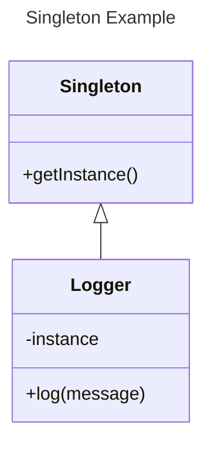
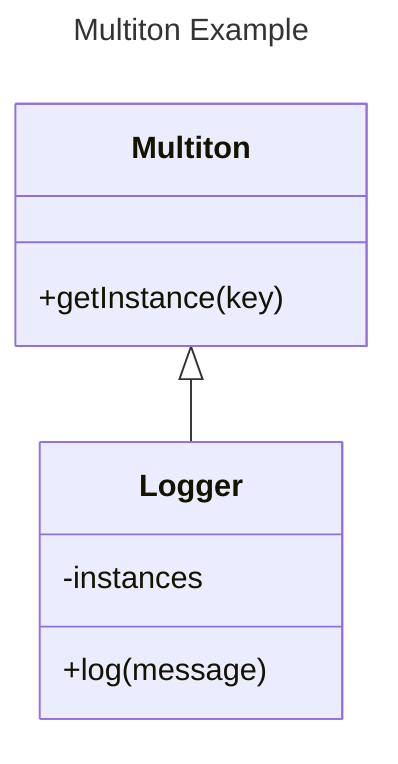

# Singleton e Multiton - Padrões de Projeto

## Intenção

A intenção do **Singleton** é garantir que uma classe tenha uma única instância e fornecer um ponto global de acesso a ela. O **Multiton**, por outro lado, é utilizado para garantir que uma classe tenha uma única instância para cada chave específica, criando um conjunto de instâncias, mas ainda assim controlando seu número.

## Também Conhecido Como

- **Singleton**: Padrão de design de instância única.
- **Multiton**: Padrão de design de instâncias múltiplas controladas.

## Motivação

### Problema Resolvido pelo Singleton

Em alguns cenários, é necessário ter uma única instância de uma classe em todo o sistema. Um exemplo disso é o gerenciamento de conexões com banco de dados ou configuração de log, onde ter várias instâncias pode gerar problemas, como a perda de dados ou uso excessivo de recursos. O **Singleton** resolve isso ao garantir que só exista uma instância e forneça acesso a ela de qualquer parte do sistema.

### Exemplo de Aplicação do Singleton:

- **Problema**: O sistema de logs precisa de uma instância única de uma classe `Logger` para registrar todas as mensagens de log. Ter várias instâncias de `Logger` pode gerar conflitos de acesso e performance.
- **Solução com Singleton**: O padrão Singleton garante que apenas uma instância do `Logger` exista, e ela pode ser acessada de qualquer parte do código.

### Exemplo Jogo 

 - **Problema**:No cenário de um jogo 2D, temos os personagens principais: o Player (representado por uma bola roxa), a Moeda (representada por uma bola amarela) e o Inimigo (um hexágono vermelho).
O objetivo do jogador é coletar o máximo de moedas enquanto evita colisões com os inimigos. Caso o Player colida com o Inimigo, ele perde sua vida, e, se a vida chegar a zero, ele "morre", precisando ressurgir no ponto inicial da fase, mas mantendo as moedas já coletadas.
Para que as informações do Player (como quantidade de moedas e pontos de vida) não sejam perdidas durante as transições de cena ou reinicialização da fase, precisamos garantir que os dados permaneçam intactos. Além disso, o Player não deve ter múltiplas instâncias no jogo, independentemente de quantas vezes a cena for reiniciada ou trocada.
 
 - **Solução com Singleton**: Para resolver o problema, utilizamos o Padrão Singleton. O Player terá uma única instância em todo o jogo, que persistirá entre as cenas e fases. Isso é feito utilizando a lógica de Singleton no método Awake, onde garantimos que, se já existir uma instância do Player, a nova será destruída.
Com isso, as informações como quantidade de moedas e pontos de vida não serão perdidas entre as transições de cena ou reinicializações da fase. Além disso, o Player mantém o ponto de respawn inicial, garantindo uma lógica eficiente e controlada.
-- script do player (bola roxa) --
```C#
    using UnityEngine;

public class Player : MonoBehaviour
{
    // Singleton
    public static Player Instance { get; private set; }

    // Atributos do player
    public int moedas { get; private set; } = 0;
    public int vida { get; private set; } = 100;

    public float velocidade = 5f; // Velocidade de movimento do player
    private Vector3 spawnPoint;  // Ponto de ressurgimento

    private Rigidbody2D rb; // Rigidbody2D para movimento físico

    private void Awake()
    {
        // Garantir Singleton
        if (Instance == null)
        {
            Instance = this;
            DontDestroyOnLoad(gameObject); // Persistir entre cenas
        }
        else
        {
            Destroy(gameObject); // Evitar múltiplas instâncias
        }
    }

    private void Start()
    {
        spawnPoint = transform.position; // Salvar o ponto inicial como ponto de ressurgimento
        rb = GetComponent<Rigidbody2D>(); // Obter referência ao Rigidbody2D
    }

    private void Update()
    {
        // Capturar entrada do teclado e movimentar o player
        Mover();
    }

    // Método para movimentar o player
    private void Mover()
    {
        float horizontal = Input.GetAxis("Horizontal"); // Entrada nas setas/A-D
        float vertical = Input.GetAxis("Vertical");     // Entrada nas setas/W-S

        Vector2 movimento = new Vector2(horizontal, vertical) * velocidade;
        rb.velocity = movimento; // Aplicar movimento ao Rigidbody2D
    }

    // Atualizar as moedas
    public void ColetarMoeda(int quantidade)
    {
        moedas += quantidade;
        Debug.Log("Moedas coletadas: " + moedas);
    }

    // Lidar com dano
    public void ReceberDano(int dano)
    {
        vida -= dano;
        if (vida <= 0)
        {
            Morrer();
        }
    }

    // Morrer e ressurgir
    private void Morrer()
    {
        Debug.Log("Player morreu!");
        vida = 100; // Restaurar vida
        Ressurgir();
    }

    private void Ressurgir()
    {
        transform.position = spawnPoint; // Voltar para o ponto de spawn
        Debug.Log("Player ressurgiu com " + moedas + " moedas.");
    }
}
```
-- script da moeda (bola amarela) --

```C#
using UnityEngine;

public class Moeda : MonoBehaviour
{
    public int valor = 1;

    private void OnTriggerEnter2D(Collider2D other)
    {
        if (other.CompareTag("Player"))
        {
            Player.Instance.ColetarMoeda(valor);
            Destroy(gameObject); // Destruir moeda após coletar
        }
    }
}
```

--script do inimigo (hexágono vermelho)--

```C#
using UnityEngine;

public class Inimigo : MonoBehaviour
{
    public int dano = 100;

    private void OnTriggerEnter2D(Collider2D other)
    {
        if (other.CompareTag("Player"))
        {
            Player.Instance.ReceberDano(dano);
        }
    }
}
```
### Problema Resolvido pelo Multiton

Quando se precisa de várias instâncias de uma classe, mas cada uma com um contexto único (por exemplo, um banco de dados diferente ou configuração de log por módulo), o **Multiton** é necessário. Diferente do Singleton, o Multiton cria instâncias separadas para diferentes chaves, garantindo que não se criem instâncias desnecessárias ou repetidas.

### Exemplo de Aplicação do Multiton:

- **Problema**: Um sistema de configuração com várias instâncias para diferentes módulos (ex.: módulo de pagamento, módulo de relatórios) precisa de um objeto único para cada módulo, mas cada um deve ser independente.
- **Solução com Multiton**: O Multiton cria uma instância única para cada módulo, controlando a criação de instâncias de forma eficiente.

## Aplicabilidade

- **Use Singleton** quando você precisa garantir que uma classe tenha apenas uma instância em todo o sistema, como para configurações globais ou para recursos compartilhados como conexões de banco de dados.
- **Use Multiton** quando você precisar de uma instância única para cada chave ou contexto, mas ainda assim com um número controlado de instâncias.

## Estrutura

### Diagrama UML do Singleton:



### Diagrama UML do Multiton:



## Participantes

### No diagrama do Singleton:

- **Singleton**: Classe responsável por controlar a criação da instância única.
- **Logger**: A classe que será instanciada como Singleton. Contém a instância única e o método `getInstance()`.

### No diagrama do Multiton:

- **Multiton**: Classe que controla a criação das instâncias, permitindo a criação de várias instâncias, uma para cada chave.
- **Logger**: A classe que será instanciada para cada chave fornecida. As instâncias são armazenadas internamente.

## Outro Exemplo

### Sem Singleton:

```java
public class SemSingleton {
    //exemplo de codigo sem singleton
}
```

### Com Singleton:

```java
public class Singleton {
   //exemplo de codigo com singleton 
}
```

### Sem Multiton:

```java
public class SemMultiton {
    //exemplo de codigo sem Multiton
}
```

### Com Multiton:

```java
public class ComMultiton {
    //exemplo de codigo com Multiton
}
```

## Colaborações

- **Singleton**: Colabora com a classe que precisa de uma instância única, garantindo que todas as requisições acessem a mesma instância.
- **Multiton**: Colabora com a classe que precisa de diferentes instâncias dependendo de um contexto ou chave.

## Consequências

### Vantagens e Desvantagens do Singleton:

- **Vantagens**: Controle total sobre a criação da instância, economizando recursos.
- **Desvantagens**: Pode ser difícil de testar (por causa da instância única), além de ser potencialmente uma dependência global.

### Vantagens e Desvantagens do Multiton:

- **Vantagens**: Controla a criação de instâncias únicas por chave, sem redundâncias.
- **Desvantagens**: Pode consumir mais memória ao criar múltiplas instâncias, dependendo de como as chaves são gerenciadas.

## Exemplos de Código

### Exemplo de Singleton:

```java
public class SingletonExample {
    }
}
```

### Exemplo de Multiton:

```java
public class MultitonExample {
    }
}
```
### Exemplo ENUM de Multiton
 - Tendo em vista que, o Enum é imutavel (em java) ele se enquadra como outro exemplo do padrão Multiton, uma vez que, cada constante de enum é, na prática, uma instância estática e única da própria classe. As instancias de enuns são estabelecidas em tempo de execução.

```Java
public Enum MultitonEnum{
}
```

## Usos Conhecidos

- **Singleton**: Gerenciamento de configuração, logs, conexões de banco de dados.
- **Multiton**: Instâncias específicas de recursos, como configurações por módulo, contextos de usuário.

## Padrões Relacionados

- **Factory Method**: O Singleton pode ser usado em conjunto com o Factory Method para fornecer instâncias de uma classe de forma controlada.
- **Abstract Factory**: O Multiton pode ser usado em uma implementação de Abstract Factory para controlar instâncias de diferentes tipos de objetos.
